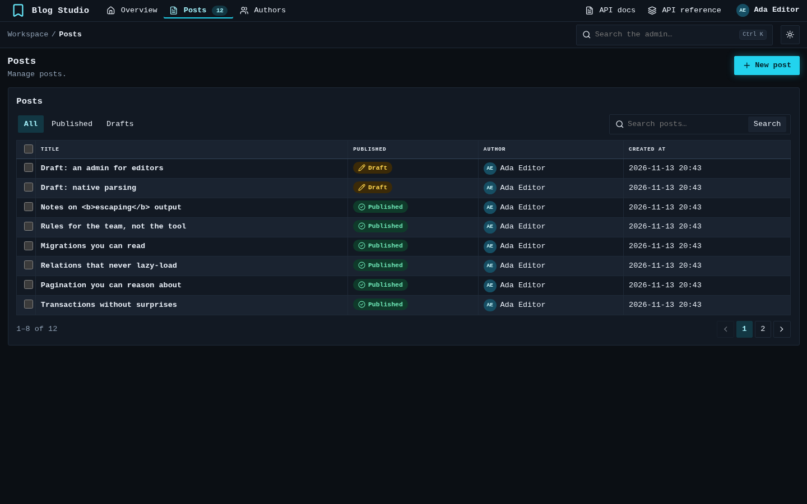
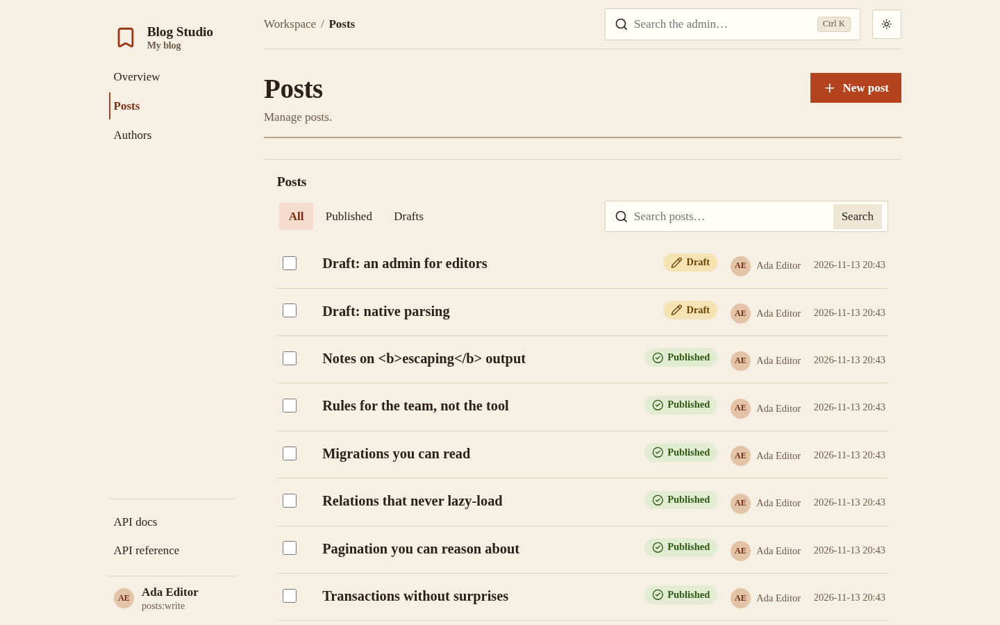
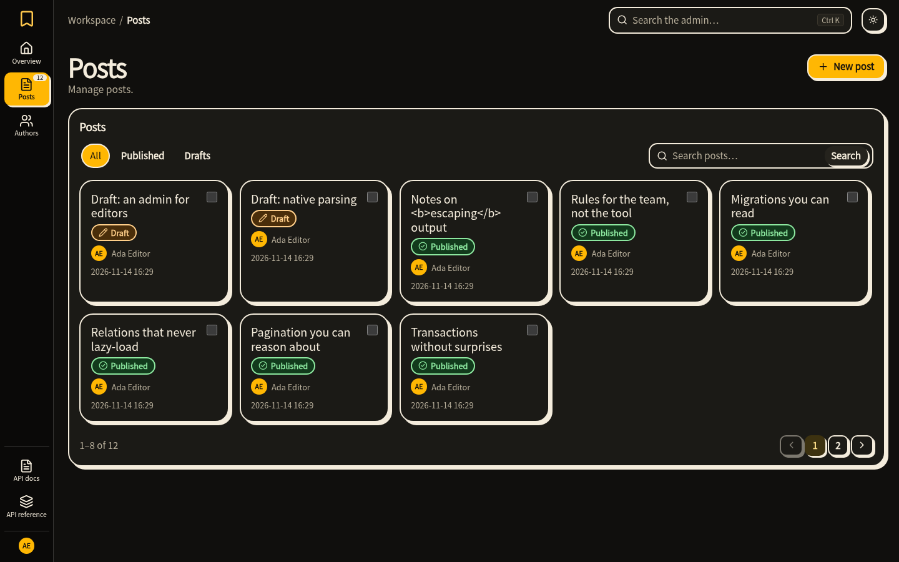

# The admin

The optional `hinoki.admin` module gives staff a list, search, create, edit, bulk delete and a dashboard for your models, with the same access policies and CSRF protection as the rest of the app. It is included in the framework package; nothing is mounted unless you ask, and importing it never touches a database.

The following excerpt follows the [Blog admin module](https://github.com/caspel26/hinoki/blob/main/examples/blog/adminsite.py). `PostAdmin` names its model once and configures how it is shown; `build_admin()` creates the cookie-authenticated `editors` policy and the `Admin` that lists the model admins; the app includes the admin under a `Mount`. The snippet shows the relevant imports and function context; consult the linked module for the complete cookie-auth implementation.

```python
from blog.adminsite import CookieAuth
from blog.models import Post, User
from blog.security import WRITE
from hinoki import Access, Mount
from hinoki.admin import Admin, ModelAdmin, Tone, action

class PostAdmin(ModelAdmin, model=Post):
    columns = ("title", "published", "author_id", "created_at")
    readonly = ("created_at",)
    assign = {"author_id": lambda principal: principal.user.id}   # set by the server
    badges = {"published": {True: ("Published", Tone.OK), False: ("Draft", Tone.WARN)}}
    tabs = ("published",)                       # one tab for each badge: Published | Draft
    fieldsets = {"Organization": ("author_id", "published")}

    @action(confirm="Publish the selected posts?")
    async def publish(self, posts, principal):
        await Post.filter(id__in=[p.id for p in posts]).aupdate({"published": True})

def build_admin(theme: str = "studio") -> Admin:
    editors = Access(auth=CookieAuth(), permissions=[WRITE])
    site = Admin(access=editors, theme=theme, site="Blog Studio", per_page=8)
    site.register(PostAdmin)                    # a customised admin ...
    site.register(User)                         # ... or a model, for the default admin
    return site

app = Hinoki(settings=BlogSettings.load(), include=[Mount("/admin", build_admin())])
```

A model admin names its model with the class keyword `model=` (`ModelAdmin[Post]` still works; naming two different models is a `RegistrationError`). `site.register(...)` takes a `ModelAdmin` class, which names its model, or a model class, which gets the default admin; it returns what it was given, so `@site.register` also works as a class decorator. The site signs its forms with `admin.secret` from the app's settings (`PREFIX_ADMIN__SECRET`, at least 32 bytes); `Admin(secret=...)` overrides it for one site, and an admin with neither stops the app at startup. The slug of a model is its table name with dashes, or the class attribute `slug = "posts"`. `site.register(Post, PostAdmin, slug="posts")` remains available.

Short forms: a badge is `Badge(label, tone, icon)` or the tuple `(label, tone)` / `(label, tone, icon)`; `tabs = ("published",)` makes one tab for each value that `badges` names for that column, labelled with the badge; `fieldsets` may be a dictionary of title to field names. `Tone` (`NEUTRAL`, `ACCENT`, `OK`, `WARN`, `DANGER`, `INFO`) is the color role of badges, stats and events; the matching strings are still accepted.

`search` names the columns the list's search box and the global search look in: a row matches when any of them contains the typed text, compared case-insensitively as text (so a number or date column matches on its printed form). Without `search` the box looks in the first three text columns that the list shows (never in a column it does not show, such as an `exclude`d token).

Row visibility, field assignment and which columns are shown are decided in the admin class; hooks (`queryset`, `can`, `display`, `stats`, `check`, `save`, `remove`) override what you need. `queryset(principal)` is the primary way to decide which rows a caller sees: counts and page numbers come from it. `can(principal, "view", row)` is also applied row by row to what a list page or the dashboard fetched, so a denied row is not shown; it can only trim the page already fetched, so a page may hold fewer rows than `per_page` and the totals still count the queryset. Mass assignment, excluded columns and out-of-scope rows are refused by the framework, and every form carries a signed CSRF token bound to the signed-in subject.

Datetime fields in the admin use the including app's `settings.timezone` (UTC when the app has no built-in settings). Forms display stored instants in that timezone and interpret edited `datetime-local` values there before saving them as UTC-aware datetimes. Times that do not exist or occur twice during a daylight-saving clock change are rejected for correction. API datetimes with offsets remain absolute instants; `utc_today()` continues to use UTC.

## What needs no configuration

A model admin states only what the model does not already say. Without being declared: the label and plural come from the model, the list's order from the model's `@ordered_by`, the "last modified" line from its `@timestamps` column, text search from the first three shown text columns, and a bulk delete wherever `can(principal, "delete")` allows it (set `bulk_delete = False` to remove it). `Admin(per_page=20, show_count=False)` sets the page size and whether the sidebar shows row counts for every model, and a model admin overrides either with its own `per_page` or `show_count`. A model with no configuration at all is `site.register(Post)`.

## Bulk actions

Add an async method to the model admin and mark it with `@action`. The list shows its action button after rows are selected:

```python
from typing import Any

from hinoki import Caller
from hinoki.admin import ModelAdmin, action


class PostAdmin(ModelAdmin, model=Post):
    @action(confirm="Publish the selected posts?")
    async def publish(self, posts: tuple[Post, ...], principal: Caller[Any]) -> None:
        await Post.filter(id__in=[post.id for post in posts]).aupdate(
            {"published": True}
        )
```

`@action` takes an optional label and `confirm`; the name is the method's with `_` written as `-`, and the label defaults to "Publish selected". The earlier form, a `BulkAction(name=..., label=..., confirm=..., handler=...)` in `bulk_actions`, still works.

The action name is also the permission checked by `ModelAdmin.can(principal, name, row)`. Hinoki checks model access before showing the button and checks every selected row against the scoped queryset and row permission both before confirmation and before execution. The confirmation includes the selected row count. If any selected row is unavailable or denied, the whole action is refused. The handler receives only the selected rows and the caller. During execution, Hinoki locks the selected model rows until the action transaction finishes, so another transaction cannot change their row-level authorization fields between the check and the handler's writes. Handlers should still apply their domain conditions to writes, especially when those conditions involve related records or external state.

Each action requires confirmation and runs inside the admin write transaction. A failure rolls back the selected work; successful actions redirect to the list with a notice. Actions accept at most 200 distinct rows. The built-in delete action is on by default (`bulk_delete = False` removes it).

## Four styles, each with light and dark

Each theme sets navigation, list presentation, typography and color. All four use the same components and provide light and dark modes; the system preference selects the initial mode, and the toggle overrides it.

| Style | Navigation | List | Edit | Look |
| --- | --- | --- | --- | --- |
| **Studio** (default) | sidebar | cards with a table | drawer beside the list | soft violet, rounded |
| **Console** | horizontal top bar | dense monospaced grid | drawer | neon cyan / teal, square |
| **Paper** | quiet text index, centred column | document rows | its own page | serif type, terracotta |
| **Bento** | dark icon rail (bottom tab bar on phones) | a grid of cards | its own page | hard ink outlines and offset shadows, bold type, solid colour tiles, yellow accent |

=== "Studio"

    
    

=== "Console"

    
    

=== "Paper"

    
    

=== "Bento"

    
    
    
    

Pick one with `Admin(theme="bento")`, or build your own: a `Theme` is a set of `--hn-*` design tokens for the two schemes plus a `layout` (`sidebar`, `topbar`, `index`, `rail`) and a `list_style` (`table`, `rows`, `cards`). The text and surface colour pairs of every built-in theme are tested against WCAG AA contrast. Bento's pages were checked in Chromium and Firefox at 1440, 390, 360 and 320 px; WebKit was not run.

## Mounting under a prefix

Include the admin under a `Mount` to choose where it lives: `Hinoki(include=[Mount("/ops", admin)])` serves it at `/ops`, and its links, assets and the CSRF cookie path use that address. Without a `Mount` the admin is at `/admin`. `Admin(prefix="/staff")` adds a path of its own after the mount (`/ops/staff`). Including `admin.api()` instead keeps the prefix it was built with.
